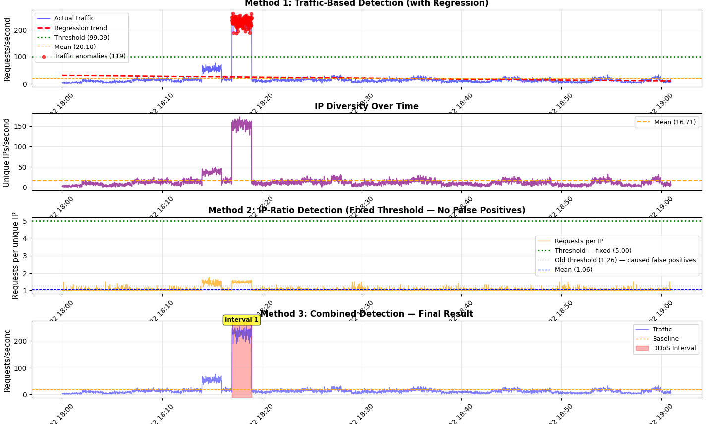

# 🛡️ DDoS Detection with IP-Ratio Analysis

**Course:** CDA01 — Task 3  
**Author:** Levan Kalatozishvili  
**Log file:** [`l_kalatozishvili25_32748_server.log`](./l_kalatozishvili25_32748_server.log)

---

## Overview

This report documents the detection of a DDoS attack in a web server log file covering **2024-03-22 18:00–19:00 (+04:00)**. The solution applies **regression-based traffic analysis** combined with **IP-ratio analysis** to distinguish real attacks from legitimate traffic spikes.

**Total records parsed: 73,385**

---

## The Core Problem

A naive approach — flagging seconds where total requests exceed a fixed threshold — fails to distinguish:

- ✅ **Legitimate spike:** many different users at once → high requests, high unique IPs, **low ratio**
- ❌ **DDoS attack:** few IPs flooding the server → high requests, few unique IPs, **high ratio**

The solution computes both the traffic volume and the **requests-per-unique-IP ratio** per second. However, this particular log contains a **distributed DDoS** — at each individual second ~262 distinct IPs are active, making the per-second ratio appear normal (≈1.0). The attack is only visible at the **traffic volume level**: 229 req/s average vs a 20 req/s baseline.

This is why regression-based traffic analysis is the decisive method here, while IP-ratio analysis serves as a structural safeguard for concentrated single-source attacks.

---

## Methodology

### Method 1 — Traffic-Based Detection (Regression)

Requests per second are aggregated into a 1-second time series. A **linear regression** is fitted over the entire hour to capture the natural traffic trend. Seconds exceeding the threshold are flagged:

```
threshold = mean + 2.0 × std_dev
         = 20.10 + 2.0 × 39.64
         = 99.39 req/s
```

| Metric | Value |
|---|---|
| Mean | 20.10 req/s |
| Std Dev | 39.64 |
| Threshold | 99.39 req/s |
| Anomalies detected | 119 seconds |
| Anomaly window | 18:17:01 – 18:18:59 |

### Method 2 — IP-Ratio Detection

For every second, both the total requests and the number of unique IPs are computed from the **same groupby** to guarantee consistency:

```python
per_sec = df_indexed.groupby(pd.Grouper(freq='1s'))['ip'].agg(
    total='count',
    unique='nunique'
)
ratio = per_sec['total'] / per_sec['unique']
```

```
threshold = max(mean + 4.0 × std_dev, 5.0)
          = max(1.06 + 4.0 × 0.13, 5.0)
          = 5.00 req/IP
```

| Metric | Value |
|---|---|
| Average unique IPs/sec | 16.71 |
| Average requests/IP | 1.06 |
| Std Dev | 0.13 |
| Threshold | 5.00 req/IP |
| Anomalies detected | 0 seconds |

> The ratio stays near 1.0 even during the attack because the DDoS is **distributed** — roughly 262 distinct IPs participate each second, each sending ~1 request/s. The attack is coordinated across many sources, so the per-second ratio does not spike. This is the defining characteristic of a **Distributed** DoS.

### Method 3 — Combined Detection

Anomalous seconds from both methods are merged and grouped into intervals:

```python
combined_anomalies = sorted(set(ddos_traffic.index) | set(ddos_ratio.index))

# Grouping rules:
# - gap > 30 s between anomalies → new interval
# - interval < 10 s → discard as noise
```

---

## Key Code Fragments

### Log Parsing

```python
def parse_log_line(line):
    pattern = r'(\S+) \S+ \S+ \[(.*?)\] "(.*?)" (\d+) (\d+)'
    match = re.match(pattern, line)
    if match:
        return {
            'ip':        match.group(1),
            'timestamp': match.group(2),
            'request':   match.group(3),
            'status':    int(match.group(4)),
            'bytes':     int(match.group(5))
        }
    return None
```

### Regression Analysis (Method 1)

```python
traffic_1sec = df_indexed['ip'].resample('1s').count()
traffic_1sec = traffic_1sec[traffic_1sec > 0]

X = np.arange(len(traffic_1sec)).reshape(-1, 1)
y = traffic_1sec.values

model = LinearRegression()
model.fit(X, y)
trend = model.predict(X)

threshold_traffic = traffic_1sec.mean() + 2.0 * traffic_1sec.std()
ddos_traffic = traffic_1sec[traffic_1sec > threshold_traffic]
```

### IP-Ratio Analysis (Method 2)

```python
# Both series computed from the same groupby to guarantee consistency
per_sec = df_indexed.groupby(pd.Grouper(freq='1s'))['ip'].agg(
    total='count',
    unique='nunique'
)
per_sec = per_sec[per_sec['total'] > 0]

ratio = per_sec['total'] / per_sec['unique']
ratio = ratio[ratio.notna() & (ratio > 0)]

# Threshold: statistical + absolute floor to prevent false positives
# (old threshold mean+1.5*std = 1.26 produced 7 false positives)
threshold_ratio = max(ratio.mean() + 4.0 * ratio.std(), 5.0)
ddos_ratio = ratio[ratio > threshold_ratio]
```

### Combined Detection & Interval Grouping (Method 3)

```python
combined_anomalies = sorted(set(ddos_traffic.index) | set(ddos_ratio.index))

intervals = []
start = combined_anomalies[0]
prev  = start

for ts in combined_anomalies[1:]:
    if (ts - prev).total_seconds() > 30:
        intervals.append((start, prev))
        start = ts
    prev = ts
intervals.append((start, prev))

intervals = [(s, e) for s, e in intervals if (e - s).total_seconds() >= 10]
```

---

## Result — Detected DDoS Interval

| Metric | Value |
|---|---|
| **Start** | **2024-03-22 18:17:01 (+04:00)** |
| **End** | **2024-03-22 18:18:59 (+04:00)** |
| **Duration** | 118 seconds (≈ 2 min) |
| Total requests | 27,265 |
| Unique IPs | 262 |
| Requests/IP (total) | 104.06 |
| Peak traffic | 262 req/s |
| Average traffic | 229.12 req/s |
| Baseline | 20.10 req/s |
| **Traffic multiplier** | **13.0× above baseline** |

> **Detection method:** Traffic-based regression (Method 1). The 229 req/s average is 11× the baseline and far exceeds the 99.39 req/s threshold.

> **Why IP-ratio did not flag this interval:** The attack is distributed — ~262 distinct source IPs participate every second, each contributing roughly 1 request. The per-second ratio therefore stays near 1.0. The 104 req/IP figure is a *cumulative* metric over the full 118-second window, not a per-second spike.

---

## Visualizations

### `ddos_improved.png` — Four-panel analysis

| Panel | Content |
|---|---|
| 1 — Traffic + Regression | Requests/sec, linear regression trend, anomalous seconds in red |
| 2 — IP Diversity | Unique IPs per second across the hour |
| 3 — Request/IP Ratio | Per-second ratio with both old and new threshold lines |
| 4 — Combined Result | Detected DDoS interval shaded in red |



### `top_ips.png` — Top 15 IP addresses by request count

Shows which IPs contributed most requests over the full log period.

---

## How to Reproduce

**1. Install dependencies**

```bash
pip install pandas numpy matplotlib scikit-learn
```

**2. Set the log file path** in `analysis.py`:

```python
file_path = r"path/to/l_kalatozishvili25_32748_server.log"
```

**3. Run**

```bash
python analysis.py
```

Plots are saved to `task_3/`. The console prints full statistics and the detected interval.

---

## Method Comparison

| | Method 1 — Traffic | Method 2 — IP-Ratio |
|---|---|---|
| Detects volume-based DDoS | ✅ | ❌ (ratio stays ~1.0) |
| Detects concentrated single-source DDoS | ✅ | ✅ |
| Distinguishes DDoS from legitimate spikes | ❌ alone | ✅ |
| **This log** | ✅ Detected | ➖ Not triggered (distributed attack) |

The combination of both methods provides the most robust detection across different attack types.
