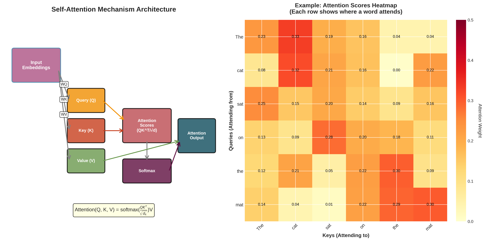
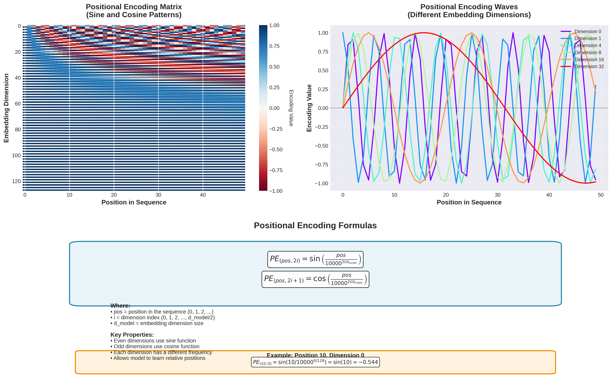

# Transformer Networks and Their Applications in Cybersecurity

## Overview of Transformer Networks

Transformer networks are a type of deep learning model introduced by Vaswani et al. in 2017, primarily designed for natural language processing (NLP). Unlike traditional recurrent neural networks (RNNs), transformers use a mechanism called **self-attention**, which allows them to weigh the importance of different words in a sentence, regardless of their position. This architecture enables parallel processing, making transformers highly efficient for large datasets.

### Key Components

1. **Self-Attention Mechanism**: 
   - Computes a weighted representation of the input, focusing on different parts of the data. This allows the model to capture dependencies and relationships between words effectively.

   

2. **Positional Encoding**: 
   - Since transformers do not inherently understand the order of sequences, positional encodings are added to input embeddings. This provides the model with information about the position of each word, ensuring that the sequential nature is captured.

### Attention Layer Mechanism

### Positional Encoding Diagram

## Applications in Cybersecurity

Transformer networks have shown great potential in various cybersecurity applications:

1. **Threat Detection**:
   - **Example**: Using transformers to analyze network traffic data, organizations can identify unusual patterns that may indicate a cyber attack. For instance, a sudden spike in outbound traffic from a specific device can be flagged for further investigation.

2. **Phishing Detection**:
   - **Example**: By training transformers on datasets containing thousands of phishing and legitimate emails, systems can learn to recognize deceptive language and typical phishing tactics. This can significantly reduce the risk of users falling victim to phishing scams.

3. **Malware Classification**:
   - **Example**: Transformers can be employed to analyze executable files and their behavior. By comparing the behaviors of known malware and benign software, the model can accurately classify new, unknown malware based on its actions.

4. **Natural Language Processing for Threat Intelligence**:
   - **Example**: Security analysts can use transformers to sift through vast quantities of unstructured data, such as threat reports or online posts, to extract actionable intelligence. For instance, detecting mentions of new vulnerabilities or exploits in real-time can help organizations stay ahead of potential attacks.

5. **User Behavior Analysis**:
   - **Example**: By modeling user interactions over time, transformers can help identify anomalies in user behavior that may indicate insider threats. For example, if an employee suddenly accesses sensitive data they typically do not interact with, the system can trigger alerts for investigation.

## Conclusion

The transformer architecture's efficiency and effectiveness make it a valuable tool in the ever-evolving field of cybersecurity. By leveraging its capabilities, organizations can enhance their defenses, improve detection rates, and respond more swiftly to emerging threats.

---
