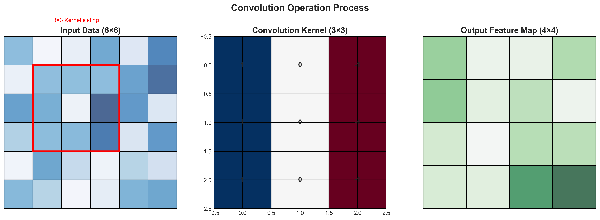
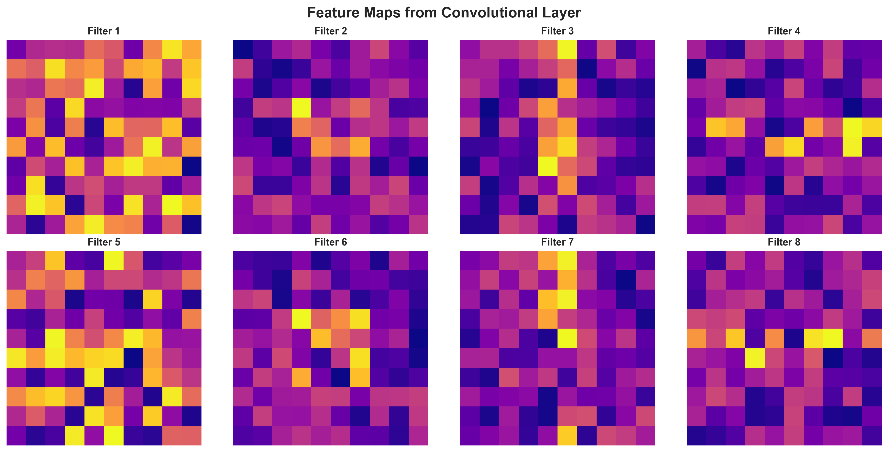
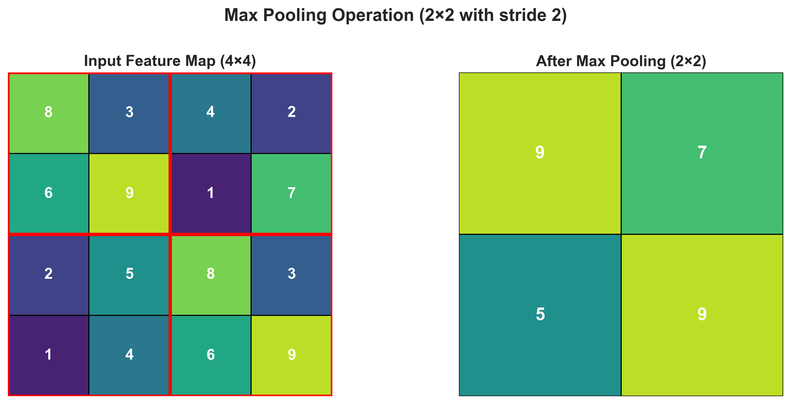
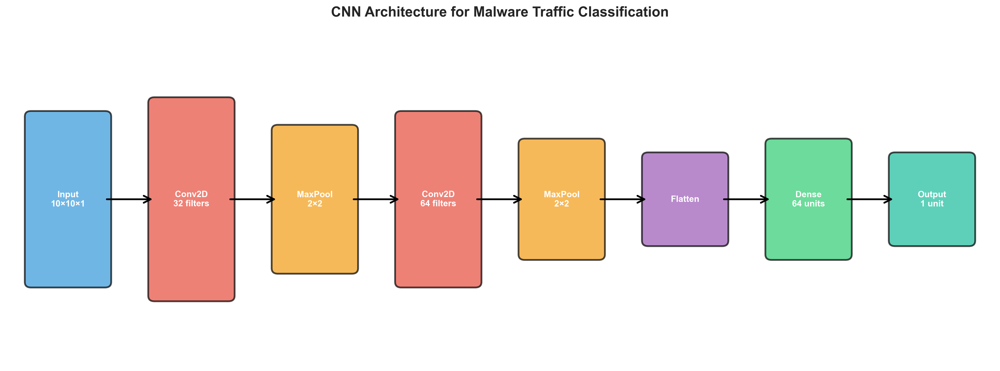
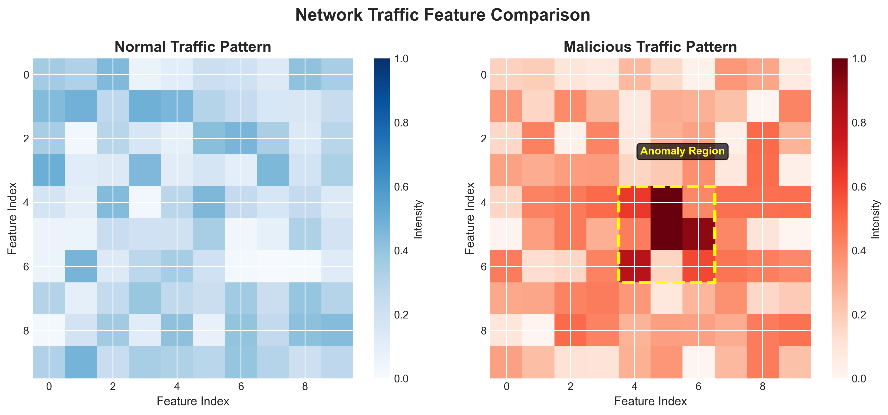

# Convolutional Neural Network (CNN)

## Introduction

Convolutional Neural Network (CNN) is a type of artificial neural network designed primarily for processing structured grid data such as images, but it is also widely used in cybersecurity tasks including intrusion detection, malware classification, and traffic analysis. CNNs are effective because they automatically learn hierarchical features from input data instead of requiring manual feature extraction.

A CNN consists of several types of layers that work together to detect patterns in data. The most important components include convolution layers, pooling layers, feature maps, and fully connected layers.

---

## Convolution Layer

The convolution layer is the core building block of a CNN. In this layer, small filters (also called kernels) slide across the input data and perform mathematical operations to detect patterns. These filters can identify features such as edges, textures, or repeating structures.

Each filter produces an output called a **feature map**, which highlights where a particular feature appears in the input. During training, the network learns the optimal filter values automatically.

The convolution operation helps reduce the number of parameters compared to fully connected networks and improves the ability of the model to generalize.



*Figure 1: The convolution operation showing input data, kernel/filter, and resulting feature map*

---

## Feature Maps

Feature maps are the outputs generated by convolution layers. Each feature map represents the detection of a specific feature in the input data. In early layers, feature maps detect simple patterns, while deeper layers detect more complex structures.

This hierarchical learning process allows CNNs to recognize high-level patterns effectively.



*Figure 2: Multiple feature maps from a convolutional layer, each detecting different patterns*

---

## Pooling Layer

Pooling layers are used to reduce the spatial size of feature maps. This helps:
- Decrease computational cost
- Reduce overfitting
- Improve model efficiency

The most common method is **max pooling**, which selects the maximum value from small regions of the feature map. This preserves the most important information while reducing data size.



*Figure 3: Max pooling operation reducing a 4×4 feature map to 2×2 by selecting maximum values*

---

## Fully Connected Layer

After several convolution and pooling operations, the output is flattened and passed to fully connected layers. These layers perform classification based on the features extracted earlier.

In cybersecurity applications, this classification step can be used to:
- Distinguish between normal and malicious traffic
- Detect malware families
- Identify anomalous behavior

The fully connected layer acts as a decision-making component of the network.

---

## CNN Architecture Overview



*Figure 4: Complete CNN architecture for malware traffic classification*

---

## Conclusion

Convolutional Neural Networks are powerful tools for pattern recognition and classification. Their ability to automatically extract meaningful features from raw data makes them highly effective in cybersecurity, especially in intrusion detection systems, network traffic classification, and malware analysis.

---

# Practical Example: CNN for Malware Traffic Classification

## Problem Description

In cybersecurity, convolutional neural networks can be used to classify network traffic and detect malicious activity. In this example, we simulate a dataset representing network traffic features and train a CNN model to classify traffic as:

- **Normal traffic (0)**
- **Malicious traffic (1)**

This demonstrates how CNN can automatically extract patterns and perform classification.

---

## Dataset

For demonstration purposes, we generate a synthetic dataset. Each sample is represented as a 10×10 matrix, simulating structured traffic features such as packet sizes, timing patterns, and protocol information.

Although synthetic, the same approach applies to real-world datasets such as:

- **CICIDS2017** - Canadian Institute for Cybersecurity Intrusion Detection Dataset
- **UNSW-NB15** - Network intrusion dataset from University of New South Wales



*Figure 5: Comparison of normal and malicious traffic patterns - note the anomaly region in malicious traffic*

---

## Python Implementation

### Import Required Libraries
```python
