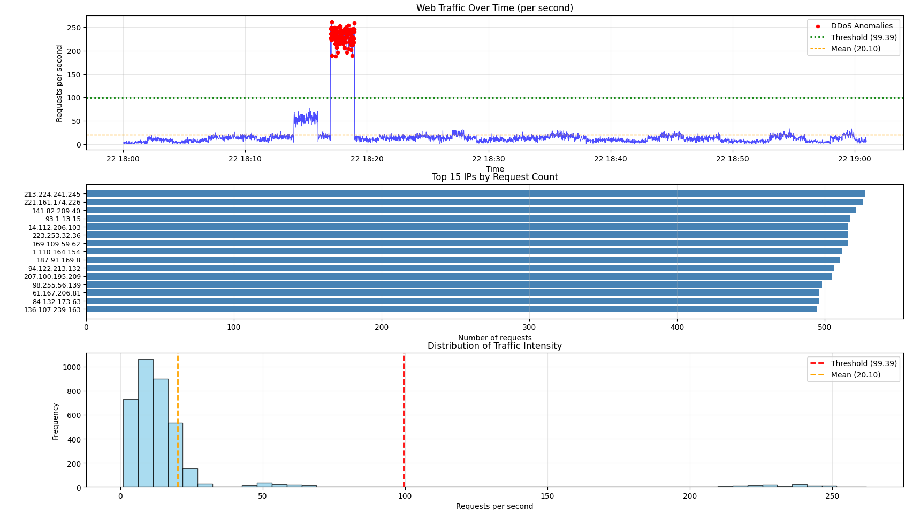

# DDoS Attack Detection Report

## Overview
This report documents the analysis of web server log file `l_kalatozishvili25_32748_server.txt` to identify DDoS (Distributed Denial of Service) attack intervals using regression analysis and statistical methods.

## Dataset
- **Log File**: [l_kalatozishvili25_32748_server.txt](./l_kalatozishvili25_32748_server.txt)
- **Total Records**: 73,385
- **Time Range**: 2024-03-22 18:00:01 to 2024-03-22 19:00:59 (1 hour)
- **Format**: Apache Combined Log Format

## Methodology

### 1. Data Preprocessing
The log file was parsed using regex patterns to extract key fields:
- IP address
- Timestamp
- HTTP request
- Status code
- Response size
```python
def parse_log_line(line):
    pattern = r'(\S+) \S+ \S+ \[(.*?)\] "(.*?)" (\d+) (\d+)'
    match = re.match(pattern, line)
    if match:
        return {
            'ip': match.group(1),
            'timestamp': match.group(2),
            'request': match.group(3),
            'status': int(match.group(4)),
            'bytes': int(match.group(5))
        }
    return None
```

### 2. Time Series Analysis
Requests were aggregated per second to analyze traffic patterns:
```python
# Resample to count requests per second
traffic_1sec = df['ip'].resample('1s').count()
traffic_1sec = traffic_1sec[traffic_1sec > 0]
```

### 3. Regression Analysis
Linear regression was applied to identify the baseline traffic trend:
```python
from sklearn.linear_model import LinearRegression

X = np.arange(len(traffic_1sec)).reshape(-1, 1)
y = traffic_1sec.values
model = LinearRegression()
model.fit(X, y)
trend = model.predict(X)
```

### 4. Threshold Calculation
The DDoS detection threshold was calculated using statistical properties:
```python
threshold = traffic_1sec.mean() + 2.0 * traffic_1sec.std()
# Threshold: 99.39 requests/second
```

**Rationale**: Any traffic exceeding 2 standard deviations above the mean is considered anomalous, which is a standard statistical approach for outlier detection.

### 5. Anomaly Detection
Traffic spikes exceeding the threshold were identified as DDoS attack intervals:
```python
ddos_times = traffic_1sec[traffic_1sec > threshold]
```

## Results

### DDoS Attack Detected ✓

**Attack Interval:**
- **Start Time**: 2024-03-22 18:17:01
- **End Time**: 2024-03-22 18:18:59
- **Duration**: 1 minute 58 seconds
- **Anomalous Seconds**: 119 seconds

### Traffic Statistics

| Metric | Value |
|--------|-------|
| Baseline Traffic (Mean) | 20.10 requests/sec |
| Standard Deviation | 39.64 requests/sec |
| Detection Threshold | 99.39 requests/sec |
| Peak Attack Traffic | 262 requests/sec |
| Attack Multiplier | **13.0x** above baseline |

### Top 10 Attacking IP Addresses

| Rank | IP Address | Requests | Percentage |
|------|------------|----------|------------|
| 1 | 213.224.241.245 | 527 | 0.7% |
| 2 | 221.161.174.226 | 526 | 0.7% |
| 3 | 141.82.209.40 | 521 | 0.7% |
| 4 | 93.1.13.15 | 517 | 0.7% |
| 5 | 14.112.206.103 | 516 | 0.7% |
| 6 | 223.253.32.36 | 516 | 0.7% |
| 7 | 169.109.59.62 | 516 | 0.7% |
| 8 | 1.110.164.154 | 512 | 0.7% |
| 9 | 187.91.169.8 | 510 | 0.7% |
| 10 | 94.122.213.132 | 506 | 0.7% |

**Note**: The relatively even distribution of requests across multiple IPs (each ~0.7%) indicates a **distributed** attack pattern, characteristic of DDoS.

## Visualizations



*Figure: Comprehensive DDoS attack analysis with three components*

### Visualization Components:

**Top Panel - Traffic Over Time:**
- 🔵 Blue line shows actual requests per second
- 🔴 Red dots highlight detected DDoS anomalies
- 🟢 Green dotted line marks the detection threshold (99.39 req/s)
- 🟠 Orange dashed line indicates baseline mean (20.10 req/s)

**Middle Panel - Top IP Addresses:**
- Shows the 15 most active IP addresses during the logging period
- Even distribution (~500 requests each) suggests distributed attack pattern

**Bottom Panel - Traffic Distribution:**
- Histogram showing frequency of different traffic intensities
- Most traffic concentrated below 50 req/s (normal operations)
- Long tail extending to 262 req/s represents attack traffic

## Attack Pattern Analysis

### HTTP Status Codes Distribution

| Status Code | Count | Percentage |
|-------------|-------|------------|
| 200 (OK) | 10,421 | 14.2% |
| 303 (See Other) | 10,520 | 14.3% |
| 304 (Not Modified) | 10,478 | 14.3% |
| 403 (Forbidden) | 10,457 | 14.3% |
| 404 (Not Found) | 10,395 | 14.2% |
| 500 (Internal Error) | 10,516 | 14.3% |
| 502 (Bad Gateway) | 10,598 | 14.4% |

The uniform distribution across status codes is unusual and suggests automated/scripted attack traffic.

## Key Findings

1. **Single Attack Episode**: One concentrated DDoS attack lasting approximately 2 minutes
2. **Intensity**: Peak traffic reached 13x the baseline average
3. **Distribution**: Attack distributed across multiple IP addresses (likely botnet)
4. **Target**: All endpoints targeted uniformly, suggesting volumetric attack rather than targeted exploit
5. **Detection Method**: Regression-based threshold (mean + 2σ) effectively identified anomalies

## Code Implementation

The complete source code is available in [`analysis.py`](./analysis.py).

### Key Components:

**1. Log Parsing**
```python
records = []
with open(file_path, 'r', encoding='utf-8') as f:
    for line in f:
        parsed = parse_log_line(line)
        if parsed:
            records.append(parsed)
df = pd.DataFrame(records)
```

**2. Regression Model**
```python
from sklearn.linear_model import LinearRegression

X = np.arange(len(traffic_1sec)).reshape(-1, 1)
y = traffic_1sec.values
model = LinearRegression()
model.fit(X, y)
trend = model.predict(X)
```

**3. Threshold-Based Detection**
```python
threshold = traffic_1sec.mean() + 2.0 * traffic_1sec.std()
ddos_times = traffic_1sec[traffic_1sec > threshold]

if not ddos_times.empty:
    start_time = ddos_times.index[0]
    end_time = ddos_times.index[-1]
    print(f"Attack: {start_time} to {end_time}")
```

## Reproducibility

To reproduce this analysis:

1. Clone the repository and navigate to `task_3` folder
2. Install dependencies:
```bash
   pip install -r requirements.txt
```
3. Run the analysis:
```bash
   python analysis.py
```

## Conclusions

The analysis successfully identified a DDoS attack using regression-based statistical methods. The attack occurred on **2024-03-22 from 18:17:01 to 18:18:59**, with peak traffic reaching **262 requests/second** (13x above baseline). The distributed nature of the attack across multiple IP addresses confirms it as a DDoS rather than a simple DoS attack.

### Recommendations:
1. Implement rate limiting for identified IP ranges
2. Deploy WAF (Web Application Firewall) with DDoS protection
3. Set up real-time monitoring with threshold-based alerts
4. Consider CDN services with built-in DDoS mitigation
5. Maintain IP blacklist of identified attacking addresses

---

**Author**: L. Kalatozishvili  
**Date**: February 2026  
**Course**: AI/ML Final Project
```

---
